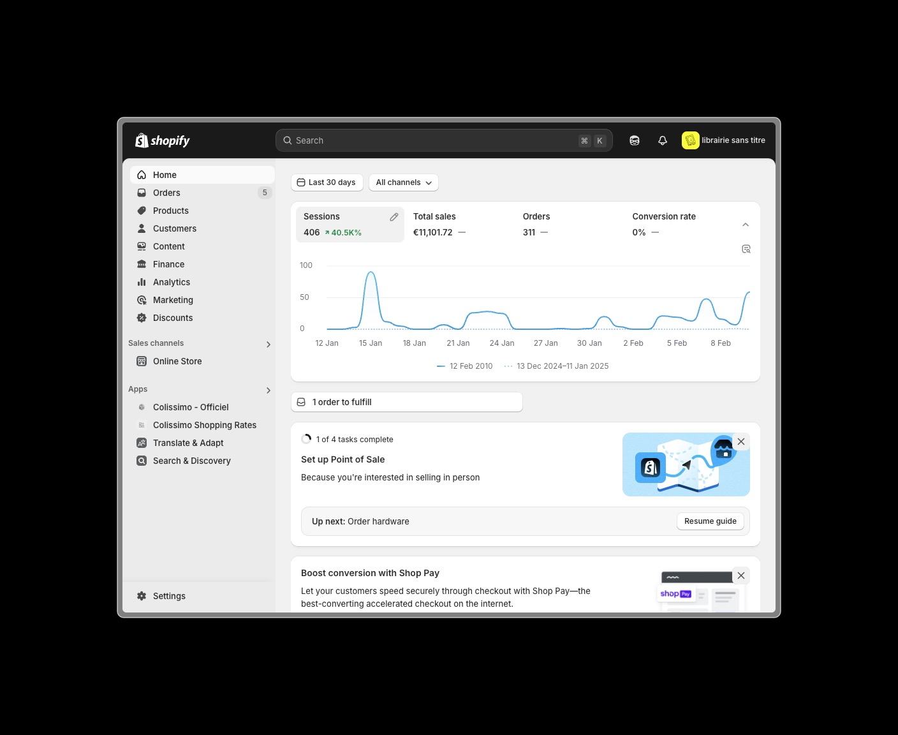
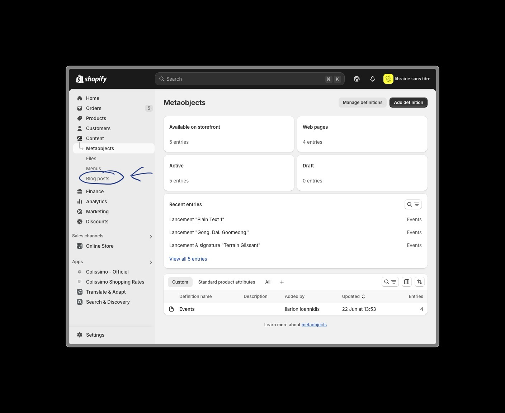
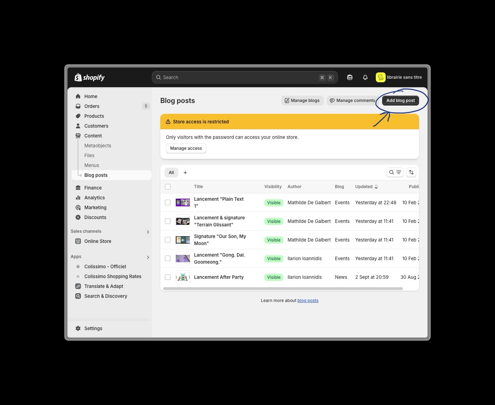
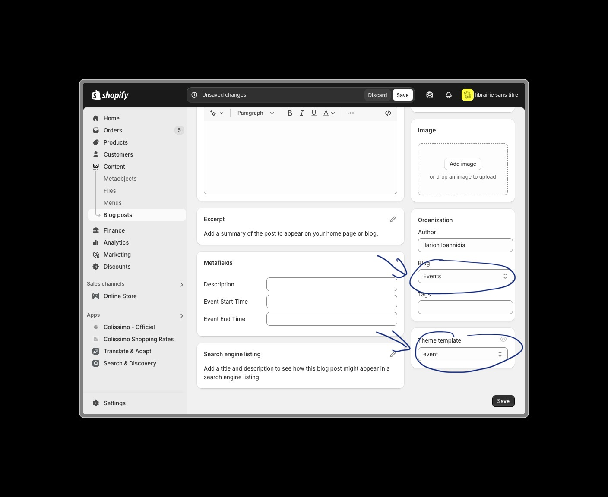
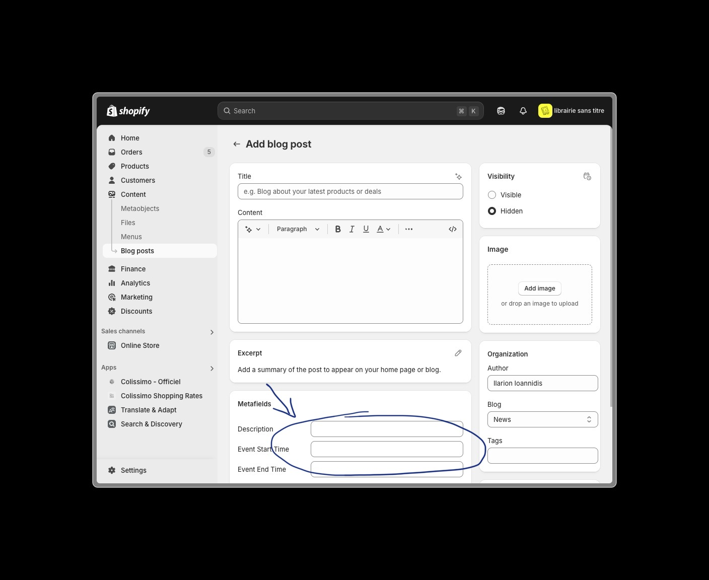
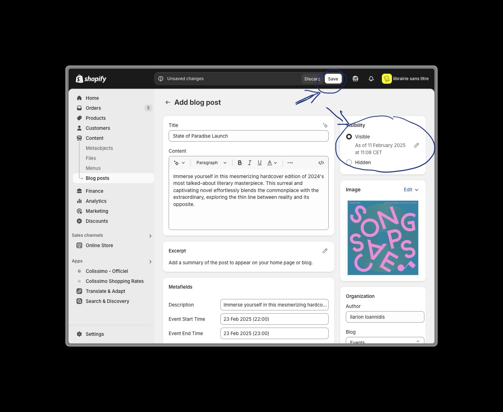

# Creating Events

This guide will walk you through the process of creating and publishing events on your Shopify store.

## Overview

Events are created using Shopify's blog functionality with a custom event template. This allows you to showcase upcoming events, workshops, book launches, and other activities at your bookstore.

## Step-by-Step Guide

### 1. Access Shopify Admin
1. Navigate to Shopify Admin https://librairie-sans-titre-2.myshopify.com/admin

### 2. Navigate to Blog Posts
1. Go to **Content** in the admin sidebar

2. Go to **Blogs** in the admin sidebar

### 3. Create New Event Post
1. Click the **Add blog post** button

### 4. Configure Event Settings
1. Select **Events** from the blog type dropdown
2. Choose the appropriate theme template

::: tip Template Selection
Make sure to select the "Event" template to ensure proper display and functionality of your event post.
:::

### 5. Add Event Metafields
1. Configure the event metafields with essential information:
   - Event Starting Date and Time
   - Event Ending Date and Time
   - Description

::: tip Important Metafields
These information will be used to display the event on the homepage.
:::

### 6. Add Event Content
1. Add the following details:
   - Event title
   - Featured image
   - SEO details
   - Author
   - Any additional content

::: tip Content Best Practices
- Don't forget to add the event image and SEO details!
:::

### 7. Publish the Event
1. Review all event details
2. Set visibility to **Visible**
3. Click **Save** to publish

<!-- 
## Event Management Tips

### Before Publishing
- Double-check all dates and times
- Verify location details
- Review image quality
- Proofread all content
- Preview on both desktop and mobile

### After Publishing
- Share on social media
- Monitor registrations
- Update details if needed
- Track engagement
- Remove or archive past events

::: warning Maintenance
Remember to:
- Keep event listings current
- Update capacity information
- Mark events as sold out when applicable
- Archive past events promptly
:::

## Additional Resources
- [Shopify Blog Posts Documentation](https://help.shopify.com/en/manual/online-store/blogs/writing-blogs)
- [Image Optimization Guidelines](https://help.shopify.com/en/manual/online-store/images/theme-images)
- [SEO Best Practices](https://help.shopify.com/en/manual/promoting-marketing/seo)  -->